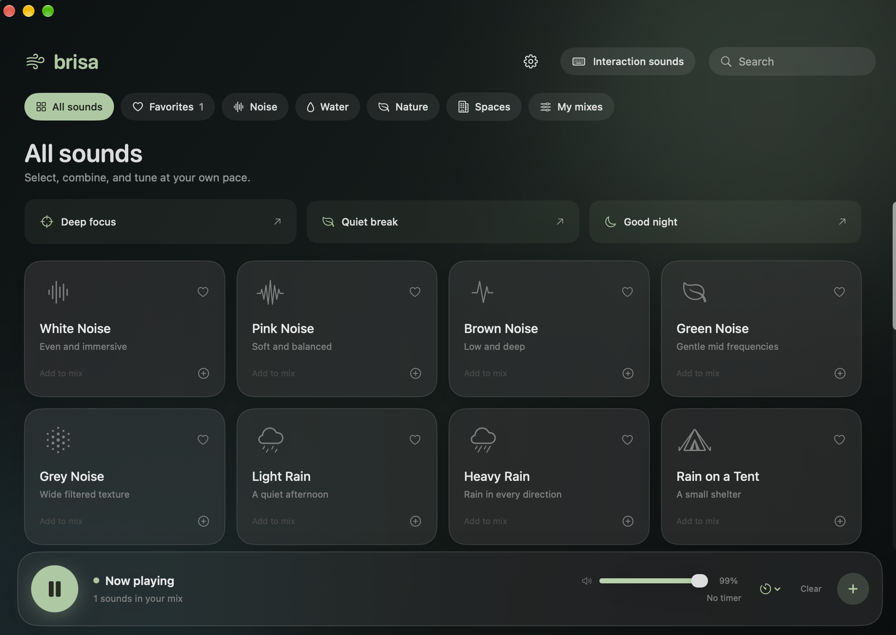
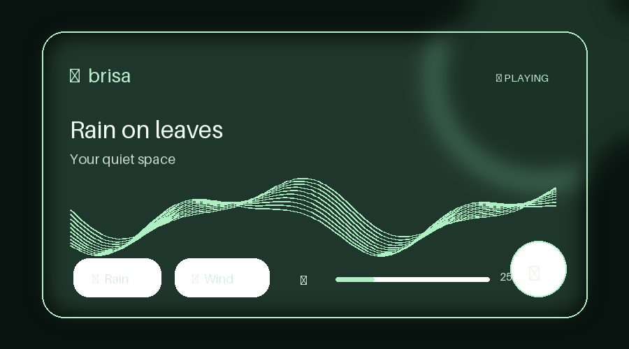

# Brisa

Brisa is a native macOS ambient-sound app for focus, rest, and sleep. Build a soundscape, save it, then control it from the menu bar. It runs locally with no account, ads, or network requests during use.

## Interface preview





## Features

- Ambient library: noise, water, nature, and indoor environments.
- Noise colours (white, pink, brown, deep brown, green, grey) generated in wide stereo with accurate spectra, and binaural beat tones under **Tones** (use headphones).
- Place each sound left or right in the stereo field, and turn on **Living mix** so volumes drift slowly and long sessions feel less static.
- Saved, editable mixes; favorites; timer; and individual sound levels. **Recent** and **Most used** shelves remember what you actually play, and sounds crossfade when you switch mixes.
- **Routines** run things at set times: start a focus session, play a mix or a video, set a sleep timer, change the volume, or show a reminder, on the days you choose. Templates included (morning focus, lunch break, wind down, gentle wake-up). Routines that came due while the Mac slept still run on wake, up to 15 minutes late.
- Share a mix as a `.brisamix` file or a `brisa://mix?d=…` link (Share button on any saved mix, **Import mix** on My mixes). Only Brisa's built-in sounds travel; anything received is validated and confirmed before it is added.
- Glass-style player and a compact menu-bar player with mute, volume, timer, and quick sound switching.
- global keyboard and mouse sounds using recorded samples.
- A first-run welcome flow and local, persistent preferences.
- Media keys, AirPods and the Now Playing menu control playback. Brisa recovers by itself when you switch or unplug headphones, pauses when the Mac sleeps and resumes on wake, and can open at login (Settings → General).
- Import WAV, AIFF, and MP3 files, or download direct HTTPS audio links into a private local library. Attribution and license notes stay with each imported source; YouTube links become video buttons in the library that play in a small floating window through YouTube’s official embedded player; Brisa never downloads or extracts YouTube audio, and only contacts YouTube when you add or play a video.

## Desktop mini player

Brisa includes an optional glass mini player for the desktop. Open Settings → Widgets to add it, drag it from any area except the volume controls, and use the pin and lock buttons on the player itself. Its position and preferences are saved locally.

## Install

Download `Brisa-macOS-arm64.dmg` from the [latest release](https://github.com/alexandre-wayss/brisa/releases/latest) and drag Brisa to Applications. The app is not notarized yet, so the first time macOS blocks it: right-click Brisa in Applications and choose **Open**, or run `xattr -d com.apple.quarantine /Applications/Brisa.app`. Requires macOS 14 on Apple silicon.

## Build from source

Install Xcode Command Line Tools first:

```sh
xcode-select --install
```

Then build and run:

```sh
cd Brisa
./Scripts/build.sh
open build/Brisa.app
```

Run the tests:

```sh
cd Brisa
./Scripts/test.sh
```

## Global keyboard and Mouse sounds

Enable **Interaction sounds** inside Brisa, then authorize Brisa in **System Settings → Privacy & Security → Accessibility**. Some macOS versions also require **Input Monitoring**. Brisa only observes event type and repeat state; it does not read, store, or transmit typed text.

## Project layout

```text
Brisa/
  Assets/                      App icon and interface preview
  Resources/Audio/             Local audio bundled in the app
  Resources/CREDITOS-AUDIO.md  Audio sources and licenses
  Scripts/build.sh             Local app build
  Scripts/package-dmg.sh       Drag-to-Applications DMG build
  Scripts/test.sh              Build and run the tests
  Sources/                     SwiftUI application modules
  Tests/                       Tests for sharing and scheduling logic
```

## License

Brisa source code is released under the [MIT License](LICENSE). Audio files retain their own licenses; see [audio credits](Brisa/Resources/CREDITOS-AUDIO.md).
