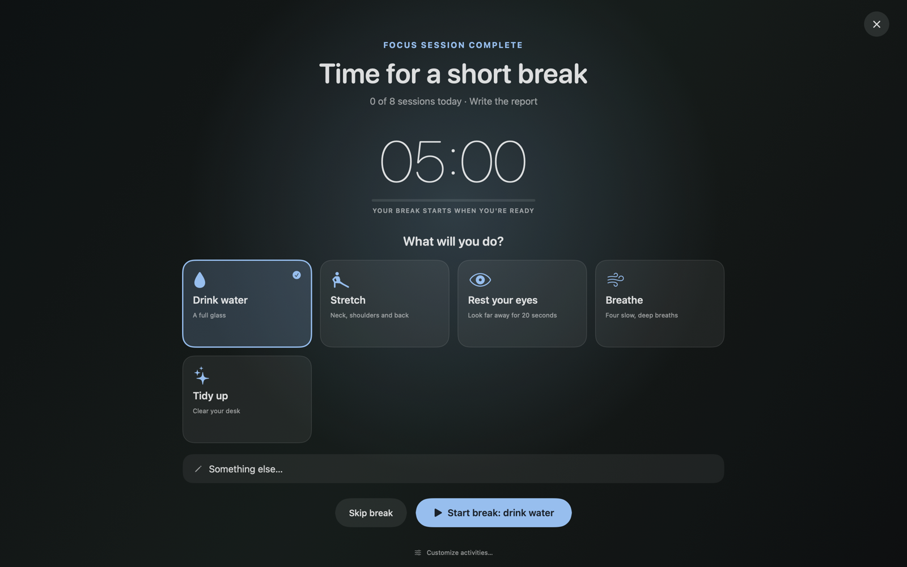

# Brisa

Brisa is a native macOS app for focus, rest, and sleep. Build an ambient soundscape, focus with a Pomodoro timer that tells you when to take a break (and helps you decide what to do in it), and control everything from the menu bar. It runs locally, with no account, no ads, and no tracking.

## Interface preview





## Features

### Sounds

- **Ambient library**: noise, water, nature and indoor spaces, including real CC0 field recordings (rain, forest, beach, fireplace, coffee shop, city).
- **Noise colours** (white, pink, brown, deep brown, green, grey) generated in wide stereo with accurate spectra, and **binaural beat tones** under **Tones** (use headphones).
- **Mix them your way**: a volume per sound, a place in the stereo field (left to right), and **Living mix**, which lets volumes drift slowly so long sessions feel less static.
- **Saved mixes**, favourites, and **Recent** and **Most used** shelves that remember what you actually play. Sounds crossfade when you switch mixes, and deleting a mix asks first.
- **Sleep timer** from 5 to 90 minutes. It counts down only while sounds play and fades them out over the last minute.
- **Share a mix** as a `.brisamix` file or a `brisa://mix?d=…` link (Share button on any saved mix, **Import mix** on My mixes). Only Brisa's built-in sounds travel; anything received is validated and confirmed before it is added.
- **Import your own audio**: WAV, AIFF and MP3 files, or direct HTTPS audio links, into a private local library (up to 250 MB; files longer than 20 minutes loop their first 20 minutes to keep memory in check). Attribution and licence notes stay with each source.
- **YouTube links** become video buttons that play in a small floating window through YouTube's official embedded player. Brisa never downloads or extracts YouTube audio.
- **Keyboard and mouse sounds** from real recordings, played as you type and click (optional, see [Permissions](#permissions)).

### Focus

- **Pomodoro timer** with focus, short break and long break lengths you choose, and a long break every few sessions. Keep a list of **tasks** with session estimates (drag to reorder, double-click to rename), and follow your **daily goal**, streak, last 7 days and recent sessions. Optional auto-start, chime, confetti, and a different soundscape for each phase. The countdown shows in the menu bar.
- **Break screen**: when a focus session ends, a full-screen screen shows the break countdown and asks what you will do: drink water, stretch, rest your eyes, play a game… or anything you type. The activities are yours to edit on the Pomodoro page (name, hint, icon, which breaks they suit, an optional break length, and an app or link to open when you pick it). The one you did least recently is suggested, so breaks vary. You can also show it when a break ends (with "5 more minutes"), keep it up for the whole break, dim other displays, or turn it off and get a notification instead.
- **Routines** run things at set times on the days you choose: start a focus session or a mode, play a mix or a video, set a sleep timer, change the volume, or show a reminder. Templates included (morning focus, lunch break, stretch reminder, wind down, gentle wake-up). A routine that came due while the Mac slept still runs on wake, up to 15 minutes late; a sleeping Mac can't play sounds, so wake-up routines need it awake.
- **Modes** set up a workspace in one click: open the apps you choose, put their windows back where you arranged them, hide or quit distracting apps, and start a sound and a focus session. Ending a mode stops the sound and the focus timer, shows hidden apps again, and minimizes or quits the mode's apps (your choice). Start modes from the Modes tab, the menu bar, or a routine.

### Around your Mac

- **Menu bar player** with play, mute, volume, sleep timer, quick sound switching and modes. Closing the window (⌘W) keeps Brisa running there, so routines and timers carry on; ⌘Q quits.
- **Desktop widgets**: a glass mini player and a Pomodoro timer (see below).
- **Themes**: Sage, Dark, Light, Ocean and Warm, previewed before you apply them.
- **Shortcuts, Siri and Spotlight**: play a mix or sound, pause, resume, set the volume, set the sleep timer, or start and pause a focus session. A **Focus filter** plays a mix and starts a focus session when a Focus turns on (System Settings → Focus → Focus filters → Brisa) and stops them when it ends. macOS only allows this for apps signed by a developer team: builds from source get it when an Apple Development certificate is in the keychain (a free Apple account in Xcode → Settings → Accounts is enough); the downloadable DMG does not include it yet.
- **Media keys**, AirPods and the Now Playing menu control playback. Brisa recovers by itself when you switch or unplug headphones, pauses when the Mac sleeps and resumes on wake, and can open at login (Settings → General).
- A first-run welcome, and preferences that are saved locally.

## Desktop widgets

Open **Settings → Widgets** to add the **mini player** (play, pause, volume, and a menu of sounds and saved mixes) or the **Pomodoro widget** (timer, start, pause, skip, and your current task). Drag a widget from anywhere except its controls; the pin button keeps it above other apps or on the desktop, and the lock button fixes its position. Positions and preferences are saved locally.

## Install

Download `Brisa-macOS-arm64.dmg` from the [latest release](https://github.com/masterCorehub/brisa/releases/latest) and drag Brisa to Applications. The app is not notarized yet, so the first time macOS blocks it: right-click Brisa in Applications and choose **Open**, or run `xattr -d com.apple.quarantine /Applications/Brisa.app`. Requires macOS 14 on Apple silicon.

## Build from source

Install Xcode Command Line Tools first:

```sh
xcode-select --install
```

Then build and run:

```sh
cd Brisa
./Scripts/build.sh
open build/Brisa.app
```

The build script refuses to overwrite an existing `build/Brisa.app`; remove it first when rebuilding. You can also open `Brisa/Brisa.xcodeproj` in Xcode.

Run the tests:

```sh
cd Brisa
./Scripts/test.sh
```

## Permissions

Brisa asks only for what a feature needs, when you turn it on:

- **Keyboard and mouse sounds**: enable **Interaction sounds** inside Brisa, then authorize Brisa in **System Settings → Privacy & Security → Accessibility**. Some macOS versions also require **Input Monitoring**. Brisa only observes the event type and whether a key is repeating; it does not read, store, or transmit typed text.
- **Modes** need **Accessibility** access to capture and restore window positions. Opening, hiding and quitting apps works without it (minimizing falls back to hiding).
- **Notifications** are used for Pomodoro phase changes (when the break screen is off) and for routines.

## Privacy

Everything you create (mixes, tasks, history, routines, modes, break activities, imported audio) stays on your Mac. Brisa only goes online when you ask it to: downloading an audio link you paste, looking up a YouTube video's title and thumbnail when you add it, and playing that video.

## Project layout

```text
Brisa/
  Assets/                      App icon and interface previews
  Brisa.xcodeproj              Xcode project
  Resources/Audio/             Local audio bundled in the app
  Resources/CREDITOS-AUDIO.md  Audio sources and licenses
  Scripts/build.sh             Local app build
  Scripts/package-dmg.sh       Drag-to-Applications DMG build
  Scripts/test.sh              Build and run the tests
  Sources/                     SwiftUI application modules (see Sources/ARCHITECTURE.md)
  Tests/                       Tests for mix sharing, routine scheduling, sound synthesis, modes and break activities
```

## License

Brisa source code is released under the [MIT License](LICENSE). Audio files retain their own licenses; see [audio credits](Brisa/Resources/CREDITOS-AUDIO.md).
