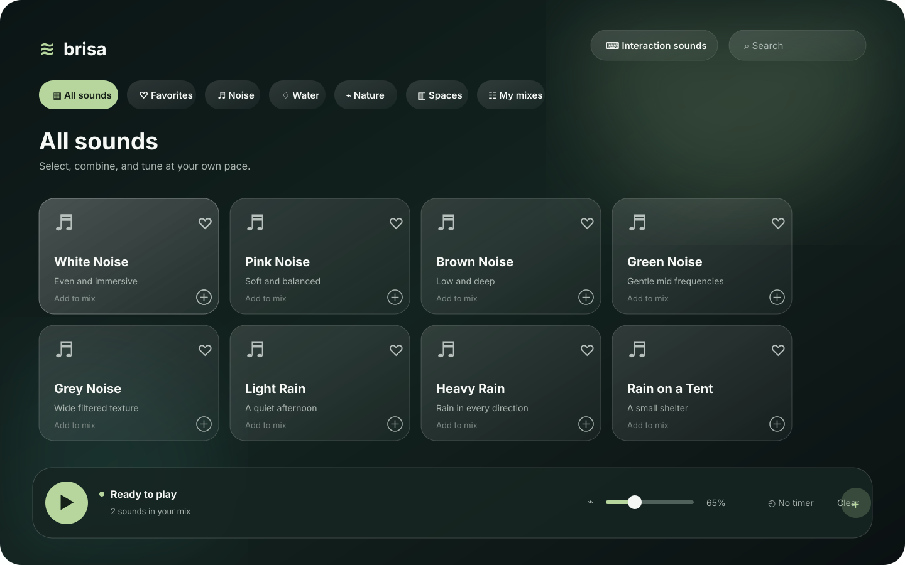

# Brisa

Brisa is a native macOS ambient-sound app for focus, rest, and sleep. Build a soundscape, save it, then control it from the menu bar. It runs locally with no account, ads, or network requests during use.

## Interface preview



## Features

- Ambient library: noise, water, nature, and indoor environments.
- Saved, editable mixes; favorites; timer; and individual sound levels.
- Glass-style player and a compact menu-bar player with mute, volume, timer, and quick sound switching.
- global keyboard and mouse sounds using recorded samples.
- A first-run welcome flow and local, persistent preferences.

## Widgets

The repository includes a glass-style WidgetKit player for the Mac desktop and a compact Control Center play/pause control for macOS 26 or later. They share playback state through an App Group; see [widget setup](Brisa/Widgets/README.md) when building the signed Xcode app target.

## Build from source

Install Xcode Command Line Tools first:

```sh
xcode-select --install
```

Then build and run:

```sh
cd Brisa
./Scripts/build.sh
open build/Brisa.app
```

## Global keyboard and Mouse sounds

Enable **Interaction sounds** inside Brisa, then authorize Brisa in **System Settings → Privacy & Security → Accessibility**. Some macOS versions also require **Input Monitoring**. Brisa only observes event type and repeat state; it does not read, store, or transmit typed text.

## Project layout

```text
Brisa/
  Assets/                      App icon and interface preview
  Resources/Audio/             Local audio bundled in the app
  Resources/CREDITOS-AUDIO.md  Audio sources and licenses
  Scripts/build.sh             Local app build
  Scripts/package-dmg.sh       Drag-to-Applications DMG build
  Sources/                     SwiftUI application modules
```

## License

Brisa source code is released under the [MIT License](LICENSE). Audio files retain their own licenses; see [audio credits](Brisa/Resources/CREDITOS-AUDIO.md).
